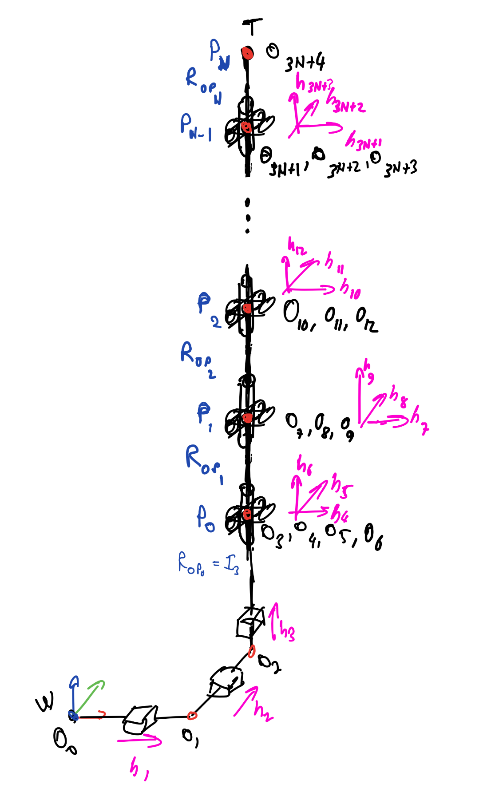
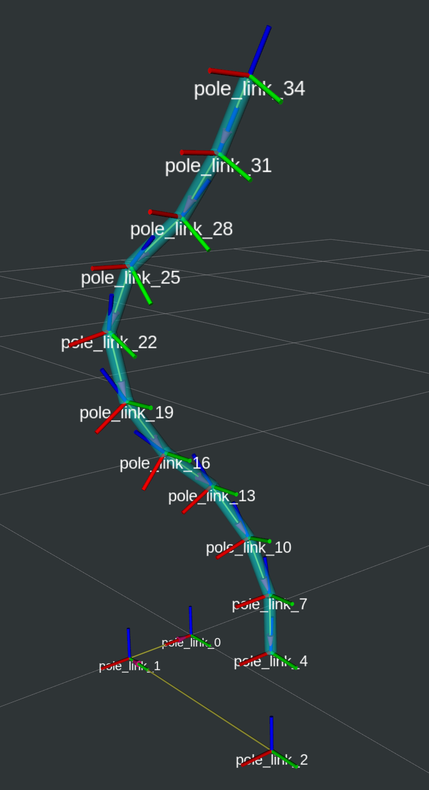
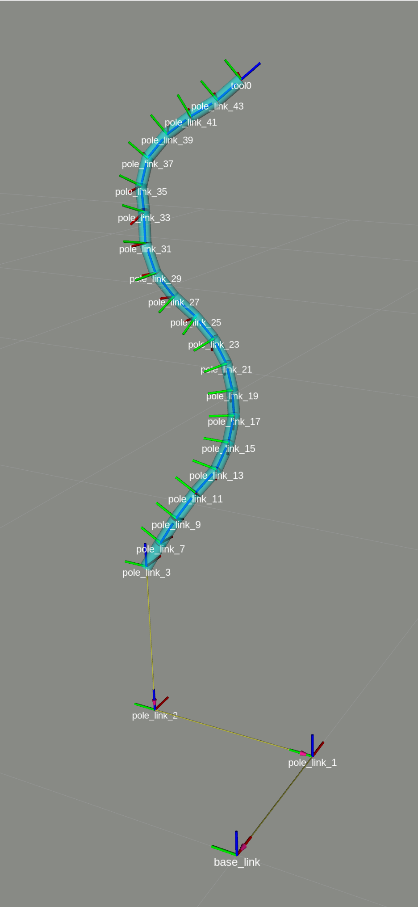

# deformable_description package

Created to be used for a planner that parses URDFs such as Tesseract.

## Automatic generation of DLO URDFs:
### `dlo_urdf_creator` package

This Python package is used to automatically generate URDFs for deformable linear objects (DLOs). It utilizes [odio_urdf](https://github.com/burakaksoy/odio_urdf.git) package to create the URDFs using Python scripting and the [yourdfpy](https://github.com/clemense/yourdfpy) library to validate and quickly visualize the generated URDFs.

### Usage

Example usage of the package is given in the `dlo_urdf_creator_example.py` file. The `create_dlo_urdf_equal_segment_length` function has the following input and output arguments:

#### Input Arguments:
- `length`: The length of the DLO.
- `radius`: The radius of the DLO.
- `simplified_dlo_num_segments`: The number of segments of the simplified DLO.
- `full_dlo_num_segments`: The number of segments of the full DLO.
- `full_dlo_holding_segment_ids`: The list of segment IDs that have holding points.
- `environment_limits_xyz`: The limits of the environment in the x, y, and z directions for the initial end of the DLO.
- `joint_angle_limits_xy_deg`: The limits of the revolute joint angles in the x and y directions in degrees.
- `model_name`: The name of the DLO as robot in the URDF.
- `base_link_name`: The name of the base link.
- `tcp_link_name`: The name of the TCP link as the end tip of the DLO. Needed to be the last link in the URDF for the planner.
- `center_link_name`: The name of the center link. At the center of the DLO URDF model.
- `holding_points_link_name_prefix`: The prefix of the holding points link names. At the holding points of the DLO URDF model.
- `visualize`: A boolean to visualize the URDF model utilizing yourdfpy library.

#### Output
The package generates a URDF string for the DLO with the given parameters.
- `urdf_str`: A string that represents the URDF file of the DLO with equal segment length.

#### Assumed Zero-configuration of the DLO and Resulting Example URDF visualizations:

Zero-configuration                |  Example Auto-generated URDF (with 10 segments) | Example Auto-generated URDF (with 20 segments)
:-------------------------:|:-------------------------:|:-------------------------:
  |   | 


## Manual generation of URDFs:
### Some useful general commands when manually creating a description using Xacro files

To confirm the syntax validity

```
check_urdf <(xacro pole.xacro)
```

To convert xacro to urdf file

```
rosrun xacro xacro pole.xacro > ./pole.urdf
```

To visualize in RVIZ

```
roslaunch urdf_tutorial display.launch model:=./pole.urdf
```
